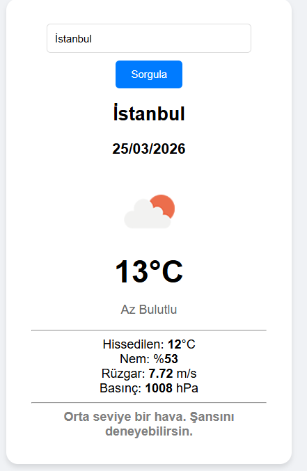

# 🎣 WeatherCast: Smart Fishing Advisor

WeatherCast is a functional and real-time weather web application designed specifically for fishing enthusiasts. It uses the **OpenWeatherMap API** to fetch live meteorological data and processes it through a custom algorithm to determine the best fishing conditions.

## 🚀 Features

- **Live Weather Data:** Get instant updates on temperature, humidity, and weather descriptions.
- **Advanced Metrics:** Displays barometric pressure (hPa), wind speed (m/s), and "feels like" temperatures.
- **Fishing Status Index:** A logic-based advisor that analyzes:
  - **Atmospheric Pressure:** Identifies the ideal feeding window for fish (1016-1022 hPa).
  - **Wind Speed:** Alerts users when winds are too harsh for a safe or productive trip.
- **Dynamic UI:** Includes weather icons, color-coded status reports, and responsive design.
- **Real-Time Date:** Automatically tracks and displays the current date.

## 🛠️ Tech Stack

- **HTML5:** Semantic structure.
- **CSS3:** Modern UI with a clean, centered card layout.
- **JavaScript (ES6+):** - `Fetch API` for asynchronous data handling.
  - `Async/Await` pattern for clean code structure.
  - `DOM Manipulation` for real-time updates.
- **API:** OpenWeatherMap API (Current Weather Data 2.5).

## 📸 Preview

 

## ⚙️ Installation & Usage

1. **Clone the repository:**
   ```bash
   git clone [https://github.com/YOUR_USERNAME/YOUR_REPO_NAME.git](https://github.com/YOUR_USERNAME/YOUR_REPO_NAME.git)
